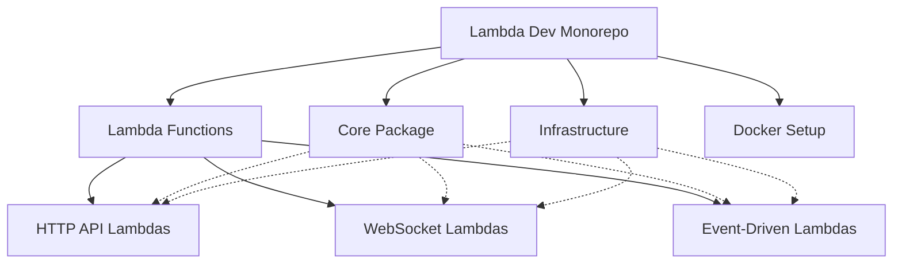
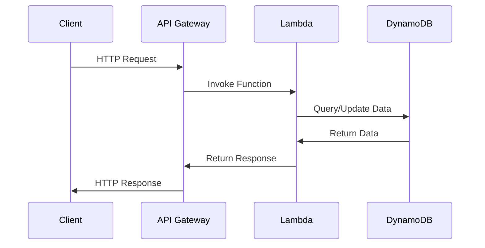
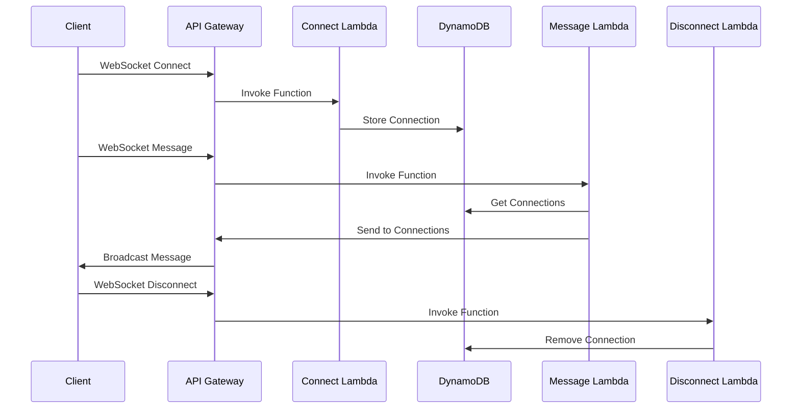
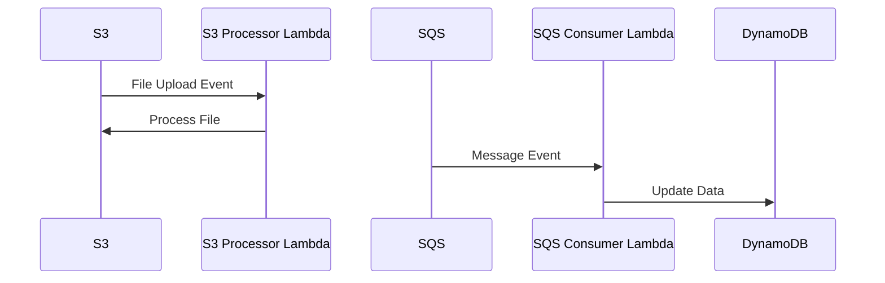
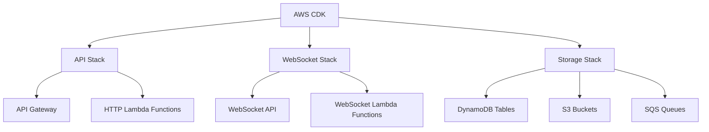
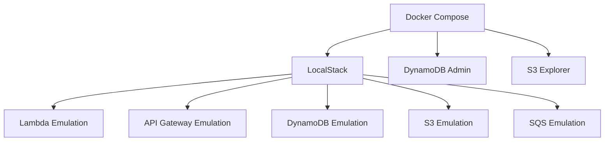
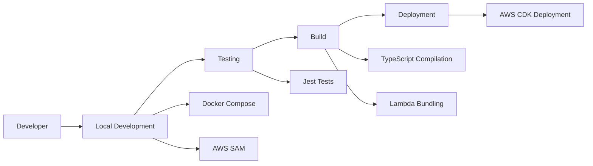

# Lambda Dev: Project Overview

## Introduction

Lambda Dev is a TypeScript-based AWS Lambda development environment designed to facilitate local development of serverless applications. This document outlines the project's architecture, components, and intended use cases.

## Project Architecture

The project follows a monorepo structure using Turborepo and pnpm, with separate packages for different concerns:

## Components

### 1. Core Package

The core package contains shared utilities, types, and helper functions used across the project:

- API response formatters
- Error handling utilities
- Common types and interfaces
- Shared business logic

### 2. Lambda Functions

#### HTTP API Lambdas

Lambda functions for handling HTTP requests through API Gateway:

#### WebSocket Lambdas

Lambda functions for handling WebSocket connections and messages:

#### Event-Driven Lambdas

Lambda functions triggered by AWS service events:

### 3. Infrastructure as Code

AWS CDK code for defining and deploying infrastructure:

### 4. Local Development Environment

Docker Compose setup with LocalStack for local development:

## Use Cases

### 1. API Development

Building REST APIs using AWS Lambda and API Gateway:

- Creating HTTP endpoints for CRUD operations
- Implementing authentication and authorization
- Handling request validation and error responses

### 2. Real-time Communication

Implementing WebSocket functionality:

- Managing WebSocket connections
- Broadcasting messages to connected clients
- Implementing real-time features like chat, notifications, etc.

### 3. Event Processing

Handling events from various AWS services:

- Processing S3 events (file uploads, deletions, etc.)
- Consuming messages from SQS queues
- Responding to other AWS service events

### 4. Local Development and Testing

Enabling developers to work locally:

- Running Lambda functions locally with hot-reloading
- Testing against emulated AWS services
- Debugging and troubleshooting without deploying to AWS

## Development Workflow

## Example Scenario: User Management API

As an example use case, we could implement a user management API with the following features:

1. **HTTP API Endpoints**:
   - `GET /users`: List all users
   - `GET /users/{id}`: Get a specific user
   - `POST /users`: Create a new user
   - `PUT /users/{id}`: Update a user
   - `DELETE /users/{id}`: Delete a user

2. **WebSocket Notifications**:
   - Real-time notifications when users are created, updated, or deleted
   - Online status updates

3. **Event Processing**:
   - Process user profile image uploads to S3
   - Handle background tasks via SQS messages

This example demonstrates how the different components of the project work together to create a complete serverless application.

## Conclusion

Lambda Dev provides a comprehensive development environment for building serverless applications with AWS Lambda. By following the monorepo structure and using tools like Turborepo, pnpm, and TypeScript, we can create a scalable and maintainable codebase that supports various use cases and deployment scenarios.
